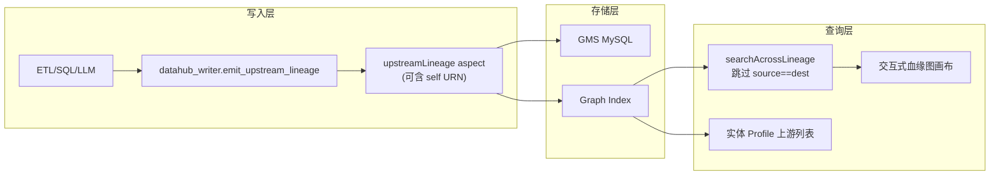

# DataHub 自环表级血缘实现方案调研

> **状态：已搁置**（2026-05-22）— 需求暂不实施，后续再评估。  
> 来源：Cursor 计划调研结论，供恢复需求时直接沿用。

## 结论摘要

| 维度 | 结论 |
|------|------|
| **能否写入** | 可以。GMS 对 `upstreamLineage` **无**「禁止自环」校验；[`emit_upstream_lineage`](../python/job_info_sync_datahub/datahub_writer.py) 当前也**不**过滤 `upstream == downstream`。 |
| **能否在血缘图里看到环** | **大概率看不到**。图查询在 [`GraphQueryBaseDAO.java`](../../metadata-io/src/main/java/com/linkedin/metadata/graph/elastic/GraphQueryBaseDAO.java) 明确 `Skip self-edges`；Lineage V2/V3 对列级自边也有过滤。 |
| **能否在实体页看到** | **部分可见**。Profile 的 [`Lineage.tsx`](../../datahub-web-react/src/app/entityV2/dataset/profile/Lineage.tsx) 展示 `upstreamLineage.entities`（关系索引）；自环边即使写入 aspect，**图遍历/UI 图**仍可能不展示，需上线后用一张表实测。 |
| **你们当前代码** | SQL 解析路径会**主动去掉**自引用：[`lineage_parser.py`](../python/job_info_sync_datahub/lineage_parser.py) 第 290–292 行 `upstreams -= target_set`；要画自环必须**显式加回**或走单独规则。 |



---

## DataHub 原生怎么做「自环边」

### 数据模型

- Aspect：[`UpstreamLineage.pdl`](../../metadata-models/src/main/pegasus/com/linkedin/dataset/UpstreamLineage.pdl) + [`Upstream.pdl`](../../metadata-models/src/main/pegasus/com/linkedin/dataset/Upstream.pdl)
- 每条上游：`dataset`（URN）+ `type`（如 `TRANSFORMED`）+ 可选 **`properties: map[string,string]`**（适合打标 `dependency_type=snapshot_carryover`）
- 写入方式（与你们一致）：对**下游 dataset URN** 发 MCP，`aspect=UpstreamLineage(upstreams=[...])`

### 平台层面对自环的态度

| 层级 | 行为 |
|------|------|
| GMS 校验 | 无专门拒绝 |
| 图索引 | 可能写入 `DownstreamOf` 边（`GraphIndexUtils` 未过滤） |
| 图查询/展开 | **过滤** `sourceUrn == destinationUrn` |
| 部分 ingestion | SQL/BigQuery SDK 路径会 `if upstream == downstream: continue`（非全局） |

**含义：**「画自环」在 DataHub 里更准确的说法是 **在 metadata 里记录自依赖**；不要预期在交互式血缘图上出现明显的自环箭头。价值主要在：**aspect 可读、搜索、下游文档、与 di 等业务上游并列展示**（若 Profile 能列出）。

### 参考写入（与你们现有代码一致）

你们已有标准入口 [`datahub_writer.emit_upstream_lineage`](../python/job_info_sync_datahub/datahub_writer.py)（约 183–251 行），逻辑为：

```python
for u_ref in table_lineage.upstreams:
    upstream_urn = make_dataset_urn_from_ref(u_ref, ...)
    upstream_classes.append(UpstreamClass(dataset=upstream_urn, type=TRANSFORMED))
# MCP: entityUrn=downstream_urn, aspect=UpstreamLineage(upstreams=upstream_classes)
```

自环只需 `TableLineage(target=TableRef("data_takeaway","pdw_order_detail_order_third_party_v1"), upstreams=[..., same TableRef])`，**无需改 GMS**。

### 业务示例（快照滚动表）

目标表：`data_takeaway.pdw_order_detail_order_third_party_v1`

| 上游 | 含义 |
|------|------|
| `data_takeaway.pdw_order_detail_order_third_party_di` | 当日增量 |
| 本表 `v1` 的 `dt=T-1` 分区 | 昨日全量快照（自依赖） |

---

## 在你们环境里的三种实现档位

### 方案 A：显式配置（低成本、低风险）

**做法**

- 在表 Documentation 或结构化属性中维护「快照自依赖」说明。
- 表级 lineage **仅连业务上游**（`pdw_order_detail_order_third_party_di`），不连自环。
- 可选：新增结构化属性，如 `blf.lineage.snapshot_self_dependency=T-1`，仅文档/检索，不写 `upstreamLineage`。

**改动范围**：文档/prompt 模板；无 `upstreamLineage` 代码变更。

| 成本 | 风险 |
|------|------|
| 0.5–1 人日 | 低。无图环、无 impact 误报 |

**适用**：以说明为主、impact 分析要保持干净。

---

### 方案 B：写入自环 + 边属性打标（推荐，中等成本）

**做法**

1. **检测**（规则，不依赖 LLM）  
   - 解析 Etl Script / SQL：目标表 `T` 且存在读 `T` 的 `dt='${DATE_SUB1DAY}'` / 昨日分区模式（可复用 [`sql_extractor`](../python/job_info_sync_datahub/sql_extractor.py) 变量展开思路）。
   - 或维护快照表名单（`_snapshot` / `_v1` + 脚本特征）。

2. **写入**  
   - 在 [`lineage_write_policy.py`](../python/job_info_sync_datahub/lineage_write_policy.py) 或 [`table_lineage_from_dataset_props.py`](../python/job_info_sync_datahub/table_lineage_from_dataset_props.py) 组装 `TableLineage` 时，在 `upstreams` 中**追加 target 自身**（仅当规则命中）。
   - 扩展 [`emit_upstream_lineage`](../python/job_info_sync_datahub/datahub_writer.py)：若 `upstream_urn == downstream_urn`，设置  
     `UpstreamClass(..., properties={"dependency_type": "snapshot_carryover", "temporal_lag": "1d"})`。

3. **与现有逻辑对齐**  
   - **取消或绕过** [`lineage_parser.py`](../python/job_info_sync_datahub/lineage_parser.py) 对「同语句内 target」的剔除，改为：SQL 解析仍剔除 INSERT 目标误报，但**快照规则命中时由策略层显式加回 self**。
   - [`compare_existing_lineage`](../python/job_info_sync_datahub/table_lineage_from_dataset_props.py) 需把「预期的 self」算作 `expected_upstreams`，避免 CHECK 报 missing。

4. **测试（TDD）**  
   - 新增 `test_snapshot_self_lineage.py`：`detect` + `emit` mock，断言 MCP 含 self URN 与 properties。  
   - 纳入 [`run_job_info_sync_datahub_tests.sh`](../python/scripts/run_job_info_sync_datahub_tests.sh) 默认门禁。

| 成本 | 风险 |
|------|------|
| 3–5 人日（规则+写入+单测+neo4j2 验证 1 张表） | **中低** |

**主要风险**

| 风险 | 缓解 |
|------|------|
| UI 血缘图仍不显示自环 | 文档 + Profile 上游列表验证；接受「元数据有、图无环」 |
| Impact 分析若基于 aspect 可能把「删自己」算进去 | 打标 `snapshot_carryover`；下游 impact 规则排除该 property |
| 与 LLM 产出 upstream 冲突 | LLM prompt 约定：业务上游 + 规则层加 self，不让模型随意加 self |
| `replace_existing_lineage` 覆盖丢边 | 合并逻辑已按 URN 去重；self 与 di 一并写入 |

---

### 方案 C：分区级 / OpenLineage 自依赖（高成本）

**做法**：不写 dataset 自环，改为 run/partition 级 input（`v1@dt=T-1` → `v1@dt=T`）。

| 成本 | 风险 |
|------|------|
| 2–4 周+（模型、ingestion、UI 支持度） | 高；与当前 Hive 表级 batch 链路脱节 |

**适用**：长期统一 OpenLineage；**不建议**作为当前 pdw 快照表的短期方案。

---

## 实现成本对比（表级自环，方案 B 细化）

| 工作项 | 人日 | 说明 |
|--------|------|------|
| 快照自依赖检测函数 | 1–1.5 | 正则 + `${DATE_SUB1DAY}` + 表名归一化 |
| 接入 `table_lineage_from_dataset_props` / batch_sync | 1 | 与 fqtn、existence 校验顺序定好 |
| `emit_upstream_lineage` properties | 0.5 | |
| 修正 `lineage_parser` 与 compare 逻辑 | 0.5–1 | |
| 单测 + 1 张表 neo4j2 验证 | 1 | 例：`data_takeaway.pdw_order_detail_order_third_party_v1` |
| 文档/prompt（Documentation 与 lineage 一致） | 0.5 | |

**合计：约 4–5 人日**（含测试与上线验证）。

---

## 风险矩阵（方案 B）

| 风险项 | 概率 | 影响 | 等级 |
|--------|------|------|------|
| 交互式血缘图不展示自环 | 高 | 用户以为没写上 | 中（需预期管理） |
| 误识别自依赖（相似表名） | 中 | 错误 upstream | 中（白名单+脚本特征） |
| Profile/GraphQL 列表是否展示 self | 中 | 产品体验不确定 | 中（**必须先做 1 表 POC**） |
| 下游 impact 误报 | 低–中 | 治理噪音 | 中（边属性过滤） |
| 与现有「去 self」SQL 逻辑打架 | 中 | 漏写或重复写 | 低（集中在一处 policy） |

---

## 推荐路径（恢复需求时）

1. **POC（0.5 人日）**：在 neo4j2 对 `data_takeaway.pdw_order_detail_order_third_party_v1` 手工 MCP 写入 self upstream（+ properties），确认 aspect / Profile / 血缘图表现。  
2. **若 POC 满足「元数据可见」→ 做方案 B**；若 Profile 也看不到 self → 降级为 **方案 A（仅文档）+ 结构化属性标记**。  
3. **不建议**短期上方案 C。

---

## 与 Documentation 任务的关系

全量 Documentation（[`table_documentation_from_dataset_props.py`](../python/job_info_sync_datahub/table_documentation_from_dataset_props.py)）可在「数据来源」写 self + di，**与表级 lineage 是两条线**。若采用方案 B，建议 Documentation 与 Lineage 共用同一套「快照表检测」函数。

---

## 待办（搁置）

- [ ] neo4j2 单表 POC：MCP 写入 self upstreamLineage + properties  
- [ ] 实现快照自依赖检测（SQL DATE_SUB1DAY + 同表读取），单测覆盖  
- [ ] 扩展 lineage_write_policy + emit_upstream_lineage，规则命中时追加 self 并打标 properties  
- [ ] 调整 lineage_parser 剔除策略与 compare_existing_lineage  
- [ ] 接入 table_lineage_from_dataset_props 批处理，文档与 lineage 共用检测逻辑  

---

## 可选后续（确认方案后）

- `--include-snapshot-self` / 环境变量 `INCLUDE_SNAPSHOT_SELF_LINEAGE=1`
- 审计 jsonl 增加字段 `snapshot_self_upstream: true`
- 更新 [`lineage_llm_compare.py`](../python/job_info_sync_datahub/lineage_llm_compare.py) SYSTEM_PROMPT：业务 upstream 与 snapshot self 分工
