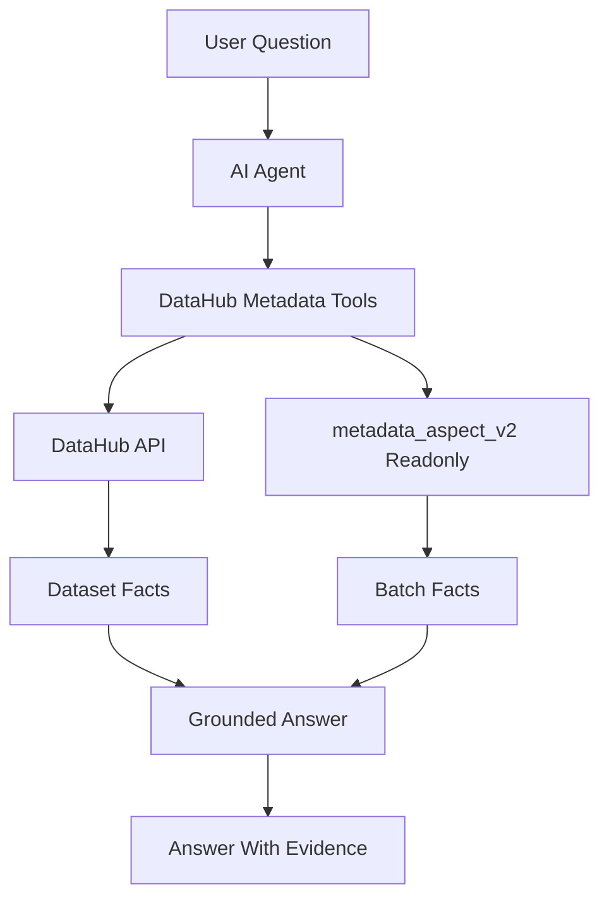

# DataHub AI/Agent 使用方案

## 目标定位

把当前 DataHub 从“人看 UI 的元数据平台”升级成“AI/Agent 可调用的数据资产知识库”。Agent 的核心能力不应是凭空总结，而是围绕 DataHub 中的结构化事实做检索、解释和报告生成。

核心事实源：

- Dataset / Schema / View Definition：表和 view 的结构事实。
- `Documentation`：LLM 已生成的加工逻辑说明，适合自然语言理解。
- `Etl Script` structured property：原始 ETL 脚本，适合核验和深挖细节。
- `upstreamLineage`：表级上下游，适合影响分析。
- `data_availability_flag`：判断资产是否适合被 Agent 直接引用。
- 报告脚本：[xander/python/job_info_sync_datahub/export_view_datasets_report.py](xander/python/job_info_sync_datahub/export_view_datasets_report.py)、[xander/python/job_info_sync_datahub/check_dataset_availability.py](xander/python/job_info_sync_datahub/check_dataset_availability.py)。

## 推荐 Agent 能力分层

### 1. 表资产问答

Agent 应支持这类问题：

- “这张表是干什么的？”
- “这张表有哪些上游？”
- “这张表有没有可用 DDL / 血缘 / 字段血缘？”
- “这张 view 有没有 View Definition？”
- “它的 ETL 脚本在哪里，核心逻辑是什么？”

回答策略：

- 优先读取 DataHub 的 `Documentation`。
- 用 `Etl Script` 做证据补充。
- 用 `upstreamLineage` 给出上游数量和关键上游。
- 用 `data_availability_flag` 告诉用户答案可信度。

### 2. 影响分析 Agent

适合改表、下线表、调整 ETL 前使用。

Agent 输入：

- 目标表名，例如 `data_build.pdw_opc_flag_flag_user`。
- 操作类型：改字段、改口径、下线、重跑、替换上游。

Agent 输出：

- 直接下游表列表。
- 递归下游影响范围。
- 高风险下游，例如 `app_`、`dm_`、`pdw_`、核心 view。
- 哪些下游元数据完整，哪些缺血缘或缺文档。
- 建议通知对象或回归清单。

### 3. ETL 逻辑解释 Agent

用于把脚本和 Documentation 变成可读解释。

回答应包含：

- 表用途概览。
- 主要输入表。
- 核心 join / filter / union / 聚合逻辑。
- 产出粒度。
- 分区字段和调度周期。
- 可疑点或质量风险。

Agent 应遵守一个原则：

- `Documentation` 是摘要。
- `Etl Script` 是最终证据。
- 两者不一致时，明确提示“文档与脚本可能不一致”。

### 4. 数据资产推荐 Agent

用于“我想找某类数据”的场景。

例如：

- “找商品标签相关表。”
- “有没有门店维度表？”
- “找带用户标识和订单信息的表。”

检索策略：

- 先搜表名、字段名、Documentation。
- 再按 availability flag 过滤低质量资产。
- 优先推荐 `DDL, 表血缘, 字段血缘` 完整的资产。
- 同时说明推荐依据和风险。

### 5. 元数据治理 Agent

用于平台侧持续维护质量。

Agent 定期回答：

- 哪些表缺 Documentation？
- 哪些非 ODS 表没有上游？
- 哪些 view 缺 View Definition？
- 哪些表有 ETL Script 但没有血缘？
- 哪些 Documentation 的第 4 节解析不到上游？

可以复用现有脚本：

- [xander/python/job_info_sync_datahub/check_dataset_availability.py](xander/python/job_info_sync_datahub/check_dataset_availability.py)
- [xander/python/job_info_sync_datahub/export_view_datasets_report.py](xander/python/job_info_sync_datahub/export_view_datasets_report.py)
- [xander/python/job_info_sync_datahub/batch_update_view_availability_flags.py](xander/python/job_info_sync_datahub/batch_update_view_availability_flags.py)

## Agent 数据访问建议

建议做一个轻量的“DataHub 元数据查询工具层”，不要让 Agent 直接拼复杂 SQL 或直接读 MySQL。

工具层可以提供这些能力：

- `get_dataset_profile(table)`：返回表基础信息、flag、schema、是否 view。
- `get_documentation(table)`：返回 Documentation。
- `get_etl_script(table)`：返回 structured property `Etl Script`。
- `get_upstreams(table, depth=1)`：返回上游。
- `get_downstreams(table, depth=1)`：返回下游。
- `search_datasets(keyword, only_available=true)`：搜索候选表。
- `audit_dataset(table)`：返回元数据完整性诊断。

建议数据流：

## 回答可信度规则

Agent 回答时建议固定加一个“可信度/元数据状态”判断：

- 如果 `data_availability_flag` 包含 `DDL, 表血缘, 字段血缘`，可标为“元数据较完整”。
- 如果只有 `DDL`，只能回答结构，不能强答血缘。
- 如果缺 `Documentation`，只能基于 ETL Script 临时解释。
- 如果缺 `Etl Script`，需要提示无法核验加工逻辑。
- 如果血缘为空但表名前缀不是 `ods_`，要提示可能缺失上游。

## 最小可落地版本

第一版不用做复杂 RAG，先做 5 个高价值命令型 Agent 能力：

- 查表说明：输入表名，输出用途、DDL 状态、文档摘要、ETL 证据。
- 查上游：输入表名，输出直接上游和 Documentation 第 4 节来源。
- 查下游影响：输入表名，输出直接/递归下游。
- 查可用资产：输入关键词，按 availability flag 推荐表。
- 查治理缺口：按规则输出缺文档、缺血缘、缺 View Definition 的清单。

## 实施边界

短期不建议直接让 Agent 自动改 DataHub 元数据。写操作如更新 `data_availability_flag`、重写血缘、重写 Documentation，仍通过现有 Jenkins 脚本或明确确认后执行。

Agent 第一阶段应以只读问答和报告生成优先，避免误写元数据。
